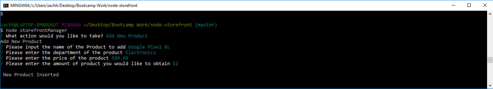

# node-storefronts

node-storefront is a node.js CLI application linked to a mySQL database.  The application keeps an inventory of various items and departments. The application includes three user interfaces that each contain seperate commands:

* storefrontCustomer
* storefrontManager
* storefrontSupervisor

### storefrontCustomer


This interface displays a table that displays the inventory information from the sql database file.  It displays the item's ID, Name, Department, Price, and Stock.  The user is prompted to input an ID number for the item they would like to purchase and the amount of stock they would like to purchase.  The database stock is updated and the purchase cost is returned to the user. 

### storefrontManager


This interface gives the user four options:

* View Products for Sale

This shows the user the same table that the customer can access.


* View Low Inventory

This creates and displays a table that shows all inventory that has less than 5 stock.


* Add to Inventory

Prompts the user to input a value to add to an item's stock.


* Add New Product

Prompts the user for information to create a new item and push it to the database.


### storefrontSupervisor


This interface gives the user two options:

* View Product Sales by Department

Creates and displays a table that shows department: id, name, overhead costs, product sales, and total profit.


* Create New Department

Prompts the user for information to create a new department and push it to the database.


## Prerequisites 

node-storefront requires the following npm packages:
- mysql
- inquirer
- cli-table

## Installing

```
npm install mysql inquirer cli-table
```

once installed, run one of the three user interfaces for the application:

```
node storefrontCustomer
```

```
node storefrontManager
```

```
node storefrontSupervisor
```
## Things to Improve

Planning on adding validation for the inputs and a back/quit option after each action chosen in the three interfaces.

## Contact Me

This application was created by **Zach Harmon** [Github](https://github.com/zachha) 

If you have any questions or need to contact me I can be reached at 
zachha@gmail.com
